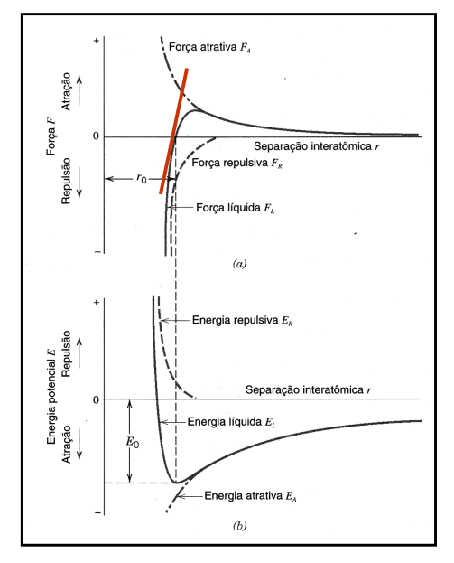

# Aula 01 - Materiais cerâmicos e suas propriedades

- **O que são materiais cerâmicos?** São todos os materiais inorgânicos não metálicos *(NaCl, LiF, BeO, MgO, TiC, etc.)*;
- **Quais são as principais propriedades dos materiais cerâmicos?**
    - **Fragilidade à temperatura ambiente**; principalmente relacionado às ligações químicas covalente e iônica
    - **Baixa condutividade elétrica e térmica**; os elétrons de valência não estão livres como nos metais, "presos às ligações"; exceções: diamante (bom condutor térmico), supercondutores ($YBa_2Cu_3O_7$)
    - **Resistência à compressão (mais fortes do que em tração)**
    - **Resistência à ataque químico (agentes corrosivos)**
- **Como os materiais cerâmicos podem ser divididos?**
    - **Cerâmicos tradicionais:** baseados em sílica e silicatos (vidros, cimento, argilas e refratários); produção em massa; e.g. tijolos, azulejos, vasos sanitários, louça
    - **Cerâmicos avançados:** pós especialmente preparados, com usos específicos e custo mais alto; aplicações em áreas de eletromagnética, ótica, térmica, nuclear, mecânica, química e biológicas
- **De quais formas os materiais cerâmicos podem ser utilizados?** Em forma de pós (catalisadores, pigmentos, abrasivos) ou na forma maciça (estruturas, elétricas, magnéticas, óticas)
- **Como corpos cerâmicos maciços são produzidos?** Possuem alta temperatura de fusão, e são frágeis; devem ser preparados a partir da forma de pó, por processos de conformação, prensagem, moldagem, sinterização
- **Como se dão os processos de conformação?** São processos que precisam conferir o máximo de empacotamento e uniformidade, com um mínimo de porosidade remanescente durante a *densificação*; é importante a obtenção de um *produto verde* próximo ao formato final, pela difícil usinagem de cerâmicos (que também gera defeitos superficiais que afetam sua resistência mecânica)
- **Quais são os métodos de conformação?** São eles: prensagem, colagem em barbotina, moldagem em fita, extrusão e moldagem por injeção
- **Como se dá o processo de prensagem?** Um pó solto é prensado à seco ou com a adição de um ligante; a pressão é aplicada uniaxialmente (para formatos mais simples) ou isostáticamente (para formatos mais complexos)
- **Como é dada a prensagem em pressão isostática?** O pó é colocado num molde de borracha e imersa em um fluido (água ou óleo), sendo pressurizado e transmitindo a pressão uniformemente para o molde
- **Como é dada a moldagem em barbotina (slip casting)?** Requer suspensão do pó cerâmico em líquido formando uma lama, vazada em molde (tipicamente de gesso) para remoção do líquido; usada para fabricar produtos de cerâmica tradicional e avançada
- **Como é dada a moldagem em fita (tape casting)?** A moldagem em fita fabrica placas cerâmicas planas finas; é usada principalmente para produção de capacitores; uma lama de pó cerâmico é espalhada em uma placa de polímero em movimento para formar a fita
- **Como é dada a conformação plástica?** O pó cerâmico é misturado com uma grande quantidade de líquido (água ou líquido orgânico) para produzir uma massa deformável sob pressão; usada originalmente para argilas e foi adaptada para polímeros
- **Como é dada a moldagem por injeção?**
- **Como é dada a sinterização?**
- **Como é dado o crescimento de grão no final da sinterização?**
- **Como é a classificação de cerâmicas porosas?**
- **Quais são as caracterísitcas dos cerâmicos microporosos?**
- **Quais são as caracterísitcas dos cerâmicos mesoporosos?**
- **Quais são as caracterísitcas dos cerâmicos macroporosos?**

# Aula 02 - Ligações químicas em cerâmicos e suas propriedades

- **Como são dadas as interações interatômicas em materiais?** Todas possuem uma origem eletrostática, sendo a expressão mais simples que define sua energia de ligação:
$$
\begin{gather}
E = \frac{-A}{r^n} + \frac{B}{r^m}
\end{gather}
$$
    Onde a primeira fração é a componente atrativa e a segunda fração é a componente repulsiva; $r$ é a distância interatômica e $A, B, n, m$ são constantes que dependem do tipo de ligação
- **Qual a ligação predomintante em materiais cerâmicos?** É a ligação iônica
- **Qual seria um exemplo de ligação iônica?** Seria o $NaCl$, onde o átomo de $Na$ transfere um elétron de valência para o $Cl$ 
- **Como é definida a força atrativa eletrostática entre os íons?** Pela seguinte equação:
$$
\begin{gather}
E_a = \frac{Z_1Z_2 e^2}{4 \pi \epsilon_o r}
\end{gather}
$$
    Onde $Z$ é a valência dos íons, $e$ é a carga do elétron, $\epsilon_o$ é a permissividade elétrica em vácuo, e $r$ é a distância entre os íons

- **Como é dada a força repulsiva eletrostática entre os íons?** Ela é provocada pela superposição das camadas eletrônicas mais externas dos dois íons, snedo definida por:
$$
\begin{gather}
E_R = \frac{B}{r^n}
\end{gather}
$$
    Onde $n$ é o coeficiente de Born, uma medida da resistência dos íons de se aproximarem a uma distância menor que $r_o$

- **Qual a direcionalidade das ligações?** As ligações são não-direcionais, não definem a geometria atômica do local, que é definida pela compensação de cargas local.
- **Como é dada a predominância de forças em relação às forças interatômicas e a energia potencial?** As forças de atração predominam quando os átomos estão afastados; as forças de repulsão predominam quando os átomos estão próximos; quando a energia é mínima ($E_o$), os átomos estão em sua separação de equilíbrio ($r = r_o$), onde a força resultante será zero

- **Qual é o ponto de mínima energia, definido matematicamente?** É o ponto em que a força de ligação é zero, dada pela equação:
$$
\begin{gather}
F = \frac{dE}{dr}
\end{gather}
$$

- **Quais são as propriedades derivadas da curva de energia?** Temperatura de fusão, módulo de elasticidade e coeficiente de expansão térmica
- **Como a temperatura de fusão se relaciona com a energia de ligação?** Quanto maior for a energia de ligação ($E_o$), maior será a temperatura de fusão
- **Como o módulo de elasticidade se relaciona com as forças interatômicas?** A sua magnitude depende da inclinação da curva força vs. distância em $r_o$
- **Como se define a rigidez de uma ligação?** É a inclinação da curva força vs. distância no ponto $r_o$, sendo dada por:
$$
\begin{gather}
S_o = \left( \frac{dF}{dr} \right)_{r=r_o} = \left( \frac{d^2E}{dr^2} \right)
\end{gather}
$$
    Onde $E$ é a energia de ligação
- **Qual é a relação do módulo de elasticidade com a rigidez de uma ligação?** A rigidez é análoga à constante de mola na lei de Hooke ($\rho = \mathcal{E} \epsilon$), onde $\mathcal{E}$ é o módulo de Young

- **Como o módulo de Young varia de acordo com a energia?** Quanto maior for a curvatura da curva $E$ vs. $r$ em $r_o$, ou quanto mais profundo for o poço de energia $E_o$, maior o módulo de Young ($\mathcal{E}$)
- **Como o módulo de Young e a temperatura de fusão se relacionam?** Ambos variam com a profundidade do porço de energia ($E_o$), portanto ambos estão relacionados com a rigidez das ligações químicas

- **O que é a expansão térmica?**
- **O que é o coeficiente de expansão térmica?**
- **O que é a amplitude de vibração?**
- **Qual a relação da expansão térmica com a assimetria da curva de energia de ligação?**
- **Qual a relação da força de ligação com a curva de energia de ligação e o coeficiente de expansão térmica?**

- **O que é a resistência ao choque térmico?**
- **Como um material pode obter alta resistência ao choque térmico?**

- **O que são ligações covalentes?**
- **Qual a direcionalidade das ligações covalentes?**
- **De que forma a direcionalidade das ligações covalentes influencia nas propriedades dos materiais cerâmicos?**
- **Em qual situação se formam ligações covalentes?**
- **Como é calculado o percentual de carater iônico de uma ligação?**
- **O que são ligações metálicas?**
- **Qual a direcionalidade das ligações metálicas?**
- **Quais as caracterísitcas das ligações metálicas?**
- **O que são ligações secundárias?**
- **De que maneiras se formam ligações secundárias?**

# Aula 03

- **Quais são os arranjos únicos que definem os sistemas cristalinos?**
- **O que são redes cristalinas?**
- **O que são as redes de Bravais?**
- **Quais são as redes mais simples?**
- **Qual o modelo utilizado para se representar os átomos nas redes?**
- **O que é a rede cúbica de corpo centrado (ccc)?**
- **O que é o fator de empacotamento atômico?**
- **Como é calculado o número de átomos na célula unitária?**
- **O que é o número de coordenação?**
- **O que é a rede cúbica de face centrada (CFC)?**
- **Qual a relação do seu empacotamento com a rede CCC?**
- **O que é a rede hexagonal compacta (HC)?**
- **Qual a relação do empacotamento da rede HC com as outras redes?**
- **O que são os índices de Miller?**
- **Como são obtidos os índices de Miller?**
- **Qual a relação entre os planos e as direções cristalográficas?**

- **Como é a cristalização dos compostos cerâmicos em relação ao empacotamento?**
- **Como os íons se organizam nas estruturas em relação aos seus tamanhos?**
- **Quais são os tipos de interstícios e onde eles se formam?**
- **Quais são as relações átomo/interstício nas estruturas CFC e HC?**
- **Qual a posição dos sítios octaédricos na célula CFC?**
- **Qual a relação entre os átomos e as posições octaédricas na célula CFC?**
- **Qual a posição dos sítios tetraédricos na célula CFC e qual a sua relação com os átomos?**
- **Qual a relação entre os sítios octaédricos e tetraédricos na célula CFC?**

- **O que são as regras de Pauling?**
- **No que se baseiam as regras de Pauling?**
- **No que se baseia a estrutura cristalina adotada por um material?**
- **Como os cátions se organizam num cristal?**
- **Como o tamanho dos íons definem as estruturas e interstícios?**
- **Qual é a primeira regra de Pauling?**

- **Qual é a segunda regra de Pauling?**
- **Como é definida a força de ligação?**
- **Qual é a terceira regra de Pauling?**
- **Qual é a quarta regra de Pauling?**
- **Qual a quinta regra de Pauling?**
- **De que forma as regras de Pauling devem ser aplicadas para deduzir uma estrutura desconhecida de um composto iônico?**
- **Como é dado o polimorfismo nas estruturas?**
- **Quais são os tipos de transformações entre as fases?**

- Formação dos interstícios
    - Tetraédrico
    - Octaédrico
    - Estruturas CFC e hexagonaiss
    - Poliedros dentro da célula unitária (posição dos sítios)
    - Qual a utilidade de determinar esses sítios e estruturas?
    - Relação dos sítios da rede para os sítios intersticiais
    - O que os sítios compartilham entre si? arestas, faces, vértices
        - O que eles compartilham entre si, e não em relação à célula unitária
    - Qual a posição de cada sítio em cada tipo de célula unitária? 
- Regras de Pauling

# Aula 04

# Aula 05

- Como descobrimos o número de coordenação do ânion? (neutralidade de cargas; segunda regra de Pauling)
- O que é o corundum? ($Al_2 O_3$)
- Ilmenita: estrutura derivada do corundum
- O que é a temperatura de Curie?
- O que é polimorfismo?
- O que é piezoeletricidade?
- Espinélio 

# Aula 06 - Silicatos

- **O que é o grau de conectividade nos silicatos?**
- **O que são argilas minerais?**

# Aula 07 - Vidros

- **Quais são as definições de vidros?**
- **Quais são as definições de vidros óxidos?**

# Apresentação - Pilha a combustível de óxido sólido (PaCOS)

- Como é feito a construção de uma pilha?
- Quais são as vantagens da pilha à combustível como fonte energética?
- Como funciona a transformação da energia química para energia elétrica?
- Qual a definição da pilha à combustível em relação à sua geração de energia?
- Como é a classificação das pilhas em relação aos eletrólitos utilizados?
- Qual a utilização da pilha de membrana polimérica (PEM)?
- Qual o diferencial para a pilha de PaCOS?
- Quais são os combustíveis que podem ser utilizados na PaCOS, dependendo do tipo do anodo?
- Qual a importância do anodo na PaCOS?
- Qual a necessidade do reformador e de purificar o combustível para utilizá-lo com a PaCOS?
- Qual o funcionamento de uma célula única de pilha à combustível?
- Por que o oxigênio é inserido no catodo da pilha?
- Qual a necessidade de um eletrólito denso, permeável (em poros) para a pilha à combustível?
- Quais são os fatores que precisam ser considerados para compatibilizar os materiais na pilha (condutividade, atividade eletrocatalítica, etc.)?
- Quais são os suportes (substratos) que podem ser utilizados na pilha (anodo e eletrólito substrato)?
- Qual a vantagem de utilizar zircônia estabilizada?
- Quais as diferenças entre os suportes de eletrólito e anodo?
- Como é feito o empilhamento para a confecção da pilha?
- Qual a dificuldade em prensar as pilhas de cerâmica e como isso pode ser solucionado (placa separadora de aço)?
- Quais são os tipos de configuração de pilhas?
- Qual a função do interconector?
- Qual a linha do tempo do desenvolvimento das pilhas à combustível?
- Qual a necessidade de se trabalhar com as formas alotrópicas (fases polimórficas) de alta temperatura da Zircônia?
- Como pode-se estabilizar as fases polimórficas da zircônia? E com óxido de ítrio?
- Qual a função das lacunas de oxigênio na zircônia?
- Qual a relação da difusividade com a porcentagem de óxido de ítrio como dopante na zircônia?
- Quais são as propriedades mais importantes para estudar: a microestrutura da pilha, condutividade, estabilidade e compatibilidade, e atividade eletrocatalítica?
- O que é porosidade e tortuosidade?
- O que é a região de tripla fase na pilha à combustível? *É a região onde a reação de oxidação ocorre*.
- Quais são as propriedades requeridas no catodo da pilha?
- Qual a função de um catodo misto (com manganita, por exemplo) e a sua dopagem?
- Qual a vantagem de se utilizar níquel no catodo (com um eletrólito de 8ZEI, por exemplo)?
- O que é o CerMet Ni/ZEI?
- Qual a eficiência máxima de uma pilha à combustível e porquê o cermet Ni/ZEI é a melhor opção para anodo em relação à eficiência?
- Qual a proporção necessária do níquel no anodo nesse tipo de pilha?
- Quais são os fatores microestruturais que afetam as propriedades de condutividade elétrica no anodo de níquel na pilha à combustível?
- Qual a vantagem de se utilizar um anodo compósito em relação à expansão térmica do material durante as reações na pilha à combustível?
- Qual a dificuldade de desenvolver pilhas que realizem operações diretas com combustíveis carbonosos?
- Como é feito o processamento do catodo?
- Como é feito o processamento do eletrólito?
- O que é o tape casting?
- Como é feito o processamento do anodo?
- Como é adicionada a condutividade no anodo (através da utilização de cobre)?

# Momento magnético de spin

- Distribuição do momento magnético de spin numa célula unitária de um cerâmico (em sítios octaédricos e tetraédricos)
- Magneto de Bohr
- Projete uma ferrita msita que possua magnetização de saturação $5,25 \times 10^5 A/m$ (substituir íons na estrturua de espinélio invertido na ferrita)
- Usar o mesmo passo-a-passo para calcular o momento magnético em outros cristais (apenas se atentar à orientação dos spins)

# Misc

- Sítios tetraédricos
- Sítios da rede
- O que varia na energia é a repulsão
- Quanto maior o poço, maior a energia de ligação
